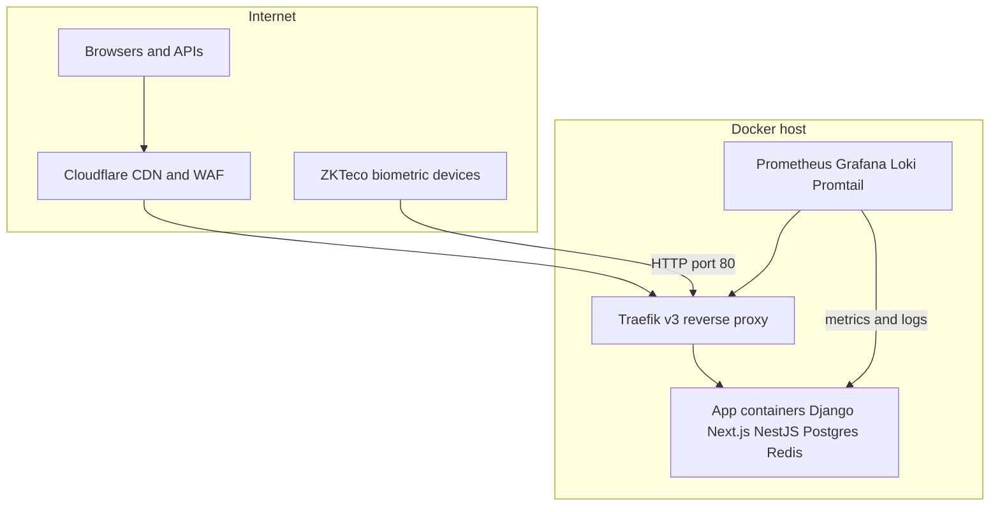

# Production Edge Infrastructure — Traefik Reverse Proxy

Docker-based reverse proxy and observability layer for a **multi-tenant SaaS platform** serving fitness, ERP, HRMS, and LMS products across multiple domains, with real-time APIs, WebSockets, and biometric device integrations.

## What this project does

This repository is the **infrastructure edge** for a production server: it terminates TLS, routes traffic to containerized applications, enforces security middleware, and provides centralized metrics and logging. Application code (Django, Next.js, NestJS) lives in separate repositories and attaches to a shared Docker network discovered automatically by Traefik.



## Platform scope

| Domain | Role |
|--------|------|
| `musfiqdehan.com` | Personal / platform apex (no tenant wildcard) |
| `mrdfit.uk` | Fitness product — tenant subdomains `*.mrdfit.uk` |
| `mrderp.uk` | ERP product — tenant subdomains `*.mrderp.uk` |
| `mrdhrms.uk` | HRMS product — tenant subdomains `*.mrdhrms.uk` |
| `mrdlms.uk` | LMS product — tenant subdomains `*.mrdlms.uk` |

Custom tenant-owned domains are also supported via dedicated routing and on-demand Let's Encrypt certificates.

## Key technical capabilities

**Reverse proxy & TLS**
- Traefik v3 with Docker label-based service discovery
- Cloudflare Origin Certificates with Let's Encrypt DNS-01 fallback (Cloudflare API)
- Trusted Cloudflare proxy IP ranges for correct `X-Forwarded-*` headers
- Multi-zone certificate management across five Cloudflare zones

**Security**
- HSTS, XSS, and content-type hardening via shared middleware chains
- API rate limiting (100 req/s average, burst 50)
- Grafana protected by Traefik basic auth plus application login
- Internal-only exposure for Prometheus and Loki

**Multi-protocol routing**
- HTTPS for APIs, admin (`/ninja`), media, static assets, and WebSockets
- Selective HTTP→HTTPS redirects on port 80 without breaking legacy device traffic
- Plain HTTP path for ZKTeco iClock ADMS biometric devices on port 80

**Observability**
- Prometheus — host, container, and Traefik metrics
- Grafana — dashboards at `grafana.musfiqdehan.com`
- Loki + Promtail — centralized logs from **all** Docker containers on the host
- Sentry Cloud integration documented for application error tracking

## Repository layout

```
traefik/
├── docker-compose.traefik.yml    # Traefik + traefik_proxy network
├── docker-compose.monitoring.yml # Prometheus, Grafana, Loki, exporters
├── traefik.yml                   # Static config: entrypoints, ACME, metrics
├── dynamic/                      # TLS, middlewares, HTTP redirect rules
├── monitoring/                   # Prometheus, Loki, Promtail, Grafana provisioning
├── certs/                        # Origin certificates (gitignored)
└── docs/                         # Setup and operations guides
```

## Architecture highlights

**Service discovery** — Backend and frontend containers opt in with `traefik.enable=true` and router labels. No manual upstream configuration when services scale or restart.

**Dual TLS strategy** — Origin certs provide immediate wildcard coverage behind Cloudflare Full (strict). Let's Encrypt acts as fallback when origin material is absent, using DNS-01 challenges across all managed zones.

**Split HTTP/HTTPS routing** — Browsers use TLS on 443; biometric hardware that cannot speak TLS continues to poll HTTP endpoints on 80, isolated from browser redirect rules.

**Observable by default** — Promtail ships every container's stdout/stderr to Loki; Prometheus scrapes Traefik's native metrics endpoint plus node-exporter and cAdvisor.

## Tech stack

| Layer | Technology |
|-------|------------|
| Reverse proxy | Traefik v3.7 |
| Container runtime | Docker Compose |
| CDN / DNS / TLS edge | Cloudflare |
| Certificate automation | ACME DNS-01 (Let's Encrypt + Cloudflare provider) |
| Metrics | Prometheus, node-exporter, cAdvisor |
| Dashboards & logs | Grafana OSS, Loki, Promtail |
| Error tracking | Sentry Cloud (SDK in apps; self-hosted option documented) |

## Documentation

Setup and operations guides live in **[docs/](docs/README.md)**:

| Guide | Topics |
|-------|--------|
| [Getting Started](docs/getting-started.md) | Env vars, startup order |
| [DNS & Domains](docs/dns-and-domains.md) | Cloudflare records per zone |
| [TLS & Certificates](docs/tls-and-certificates.md) | Origin certs, Let's Encrypt |
| [Monitoring](docs/monitoring.md) | Prometheus, Grafana, Loki |
| [Sentry Cloud](docs/sentry-cloud.md) | Hosted error tracking |
| [Self-Hosted Sentry](docs/sentry-self-hosted.md) | On-prem Sentry (16 GB+ RAM) |
| [Routing & ADMS](docs/routing-and-adms.md) | Labels, middlewares, devices |
| [Troubleshooting](docs/troubleshooting.md) | Common issues |

## Quick start

```bash
cp .env.example .env          # fill CF_DNS_API_TOKEN, GRAFANA_ADMIN_PASSWORD
htpasswd -cb dynamic/.htpasswd admin 'your-password'

docker compose --env-file .env -f docker-compose.traefik.yml up -d
docker compose --env-file .env -f docker-compose.monitoring.yml up -d
```

Full instructions: [docs/getting-started.md](docs/getting-started.md)

## Design decisions worth noting

- **File + Docker providers** — Static TLS and middlewares in `dynamic/`; routes discovered from container labels for loose coupling with app repos.
- **No public metrics ports** — Prometheus and Loki stay on the internal Docker network; only Grafana is published through Traefik.
- **Regex-based platform redirects** — Single maintainable rule covers apex + wildcard UK zones while excluding `*.musfiqdehan.com` tenant patterns.
- **12 GB RAM constraint** — Monitoring runs on-host; Sentry Cloud preferred over self-hosted to avoid memory pressure (self-hosted path still documented for larger deployments).

## Author

Infrastructure configuration for the MRD product suite (Fit, ERP, HRMS, LMS) and associated platform services.
